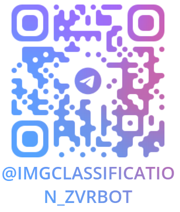

# ImgClassification_ZvrBot - Telegram бот для поиска объектов на изображении


Приложение,  которое позволяет пользователям загружать изображения, хранить их в облаке (S3), и классифицировать их, определяя, какое животное изображено на картинке. 

**Основные технологии: [telegram-bot-api](https://github.com/tdlib/telegram-bot-api), [Dramatiq](https://github.com/Bogdanp/dramatiq).**

### Требования

1. Наличие веб-интерфеса - телеграм бот;
2. Проект реализован на базе dramatiq и использует библиотеку для классификации изображение;
3. Код проекта доступен на GitHub;
4. Есть документация (readme.md), в которой указаны описание проекта, стэк, как запустить проект, как запустить тесты;
5. Возможность демонстрации работы;
8. Проект оформлен по PEP8;
9. Есть документация (readme.md), в которой указаны описание проекта, стэк, как запустить проект.

### Стэк

- Python
- TelegramBotApi
- Dramatiq
- RabbitMQ
- Opencv
- Boto3
- Ultralytics

### Описание

Телеграмм бот доступен по следующей ссылке: @ImgClassification_ZvrBot

<p align="center">
    
</p>

Предусмотрен ряд команд, чтобы пользователь мог понять, как нeжно действовать
- Базовая команда /start начинает работу с ботом. Пользователю Выводится клавиатура с 2 командами "Что я умею" и "Начать классификацию"
- "Что я умею отображает небольшое описание бота"
- "Начать классификацию" приводит к выбору модели для лкассификации - Yolo8 или NanoDet
- После выбора модели предлагается загрузить изображение для классификации
- Полученное изображение автоматически отправляется в облачное хранилище Selectel и отправляется на классификацию. За счет ассинхронной работы классификаторов можно взаимодействовать с ботом даже вов ремя классификации изображения
- После классификации пользователю приходит ответное сообщение с размеченным изображением
- После выполнения всех процедур изображения удаляются с ПК, на котором развернут бот

### Использование

#### Запуск

- Для запуска бота требуется запущенный RabbitMQ (Рабочие процессы Dramatiq запускаются автоматически вместес ботом)

- Сперва необходимо создать нудную виртуальную среду для работы проекта
```shell
pip install -r requirements.txt
```
- После можно запускать саму программу
```shell
python Main.py
```
- Для корректного завершения работы для остановки программы нужно в консоли послать сигнал остановки Ctrl+C
